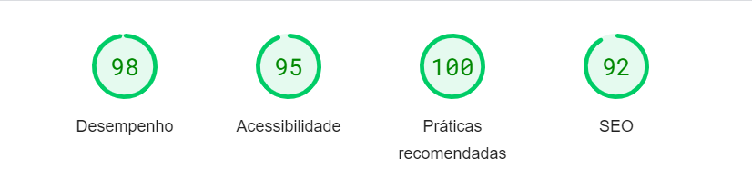

<h3 align="center">My Library | Versão 2.0.0 Concluído :white_check_mark:</h3>

---

# Atualizações do Projeto: My Library

- O projeto foi atualizado de Frontend para Fullstack;
- Agora o projeto possui sistema de autenticação de usuário com o uso do Clerk;
- Agora o projeto possui banco de dados Postgresql com o ORM Prisma;
- Melhora no UI/UX Design;
- Sistema de formulário com validação;
- Novas funcionalidades, tais como: atualização de livros, criação e atualização de anotações em cada livro e mais.

---

## Sobre o projeto :computer:

Uma aplicação web a qual o usuário pode se cadastrar, cadastrar e gerenciar seus próprios livros que possui, além de 
poder criar anotações sobre eles.
---

## Tecnologias usadas :star:

- [x] NextJS
- [x] ReactJS
- [x] Tailwind CSS
- [x] Clerk
- [x] Postgresql
- [x] Prisma
- [x] Material UI
- [x] Magic UI
- [x] Sonner Toast
- [x] SweetAlert2
- [x] Zod

---

## Funcionalidades :wrench:

- [x] Cadastro e Login de usuários;
- [x] Cadastro de livros;
- [x] Atualização de livros;
- [x] Criação de anotações;
- [x] Atualização de anotações;
- [x] Filtros de livro, como: Lido, Lendo e Não lido;
- [x] Buscar por um livro em específico com a utilização de uma barra de pesquisa
- [x] Painel mostrando todas as informações

---

  
  
  
  
  
  
  
  
  
  

---

## Desempenho :mag:

---

## Autor :raising_hand:

<b>Henry Nicollas Issicaba Neves</b>

  

